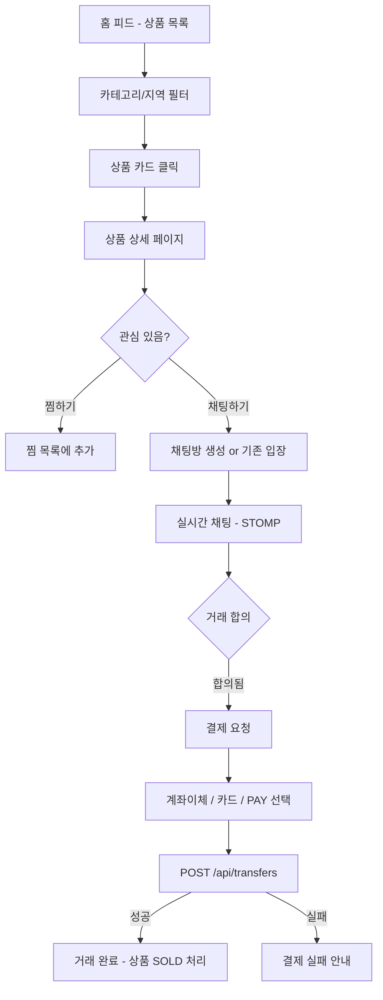
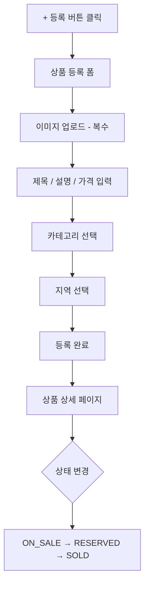
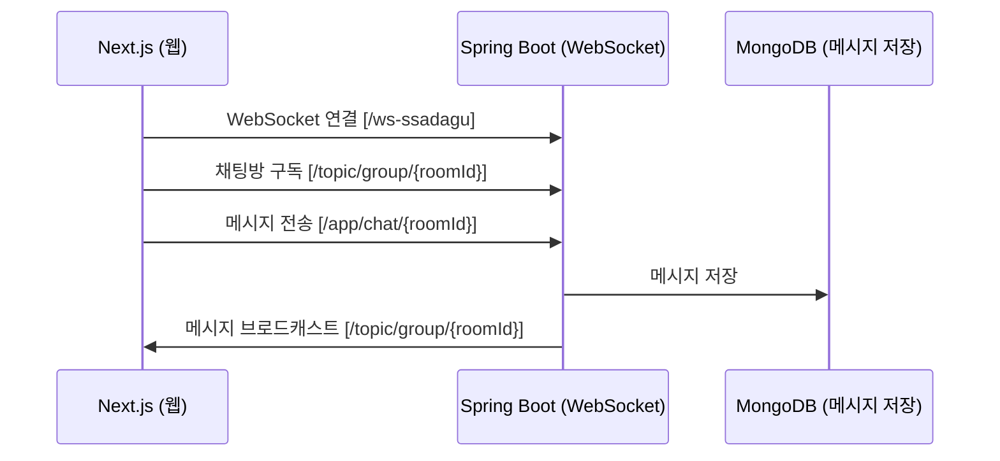
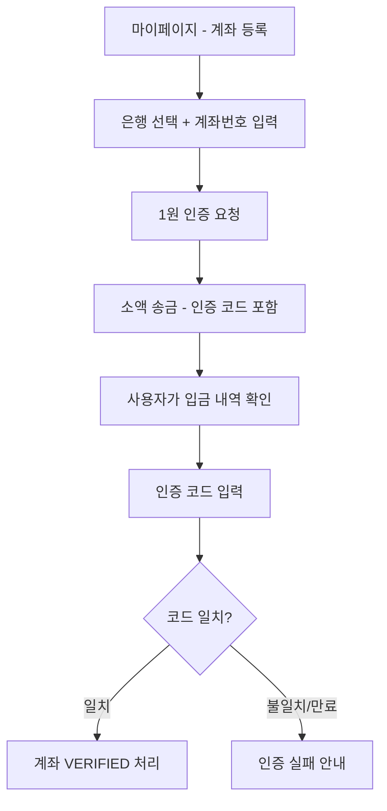

# 앱 흐름도 / User Flow — Ssadagu

> 유저가 앱에서 어떻게 이동하는지 정의합니다.
> 화면 전환 흐름 및 주요 시나리오를 포함합니다.

---

## 1. 전체 화면 구조 (Screen Map)

```
[앱 진입]
    │
    ├── 비로그인 상태 → /login
    │       └── 로그인 성공 → /home
    │
    └── 로그인 상태 → /home (탭 네비게이션)
            ├── 홈 탭 (/)
            ├── 채팅 탭 (/chat)
            ├── 상품 등록 (/products/new)
            └── 마이페이지 탭 (/my)
```

---

## 2. 인증 플로우 (Auth Flow)

```mermaid
flowchart TD
    A[앱 실행] --> B{토큰 존재?}
    B -- 없음 --> C[/login 페이지]
    B -- 있음 --> D{토큰 유효?}
    D -- 유효 --> E[/home]
    D -- 만료 --> F[Refresh Token으로 재발급]
    F -- 성공 --> E
    F -- 실패 --> C
    C --> G[이메일/비밀번호 입력]
    G --> H[POST /api/auth/login]
    H -- 성공 --> I[Access + Refresh Token 저장]
    I --> E
    H -- 실패 --> J[에러 메시지 표시]
```

---

## 3. 상품 탐색 → 채팅 → 결제 플로우 (구매자 시나리오)



---

## 4. 상품 등록 플로우 (판매자 시나리오)



---

## 5. 채팅 플로우 (실시간 메시지)



---

## 6. 계좌 인증 플로우



---

## 7. 마이페이지 흐름

```
/my
  ├── 내 정보 (닉네임, 이메일)
  ├── 계좌 관리 → /my/account
  ├── 내 판매 상품 → /my/products
  ├── 거래 내역 → /my/transactions
  ├── 찜 목록 → /my/wishes
  └── 로그아웃 → POST /api/auth/logout → /login
```

---

## 8. 모바일 특이 사항 (Hybrid App)

- 모든 화면은 Next.js 웹을 `react-native-webview`로 렌더링
- 네이티브 뒤로가기 버튼 → `ON_BACK_PRESS` 브릿지 이벤트로 웹에 전달
- 키보드 표시 → `ON_KEYBOARD_SHOW` 이벤트로 레이아웃 조정
- GPS 위치 → `ON_LOCATION_CHANGE` 이벤트로 지역 자동 설정
- 상세 브릿지 이벤트 정의는 `docs/bridge_spec.md` 참조
